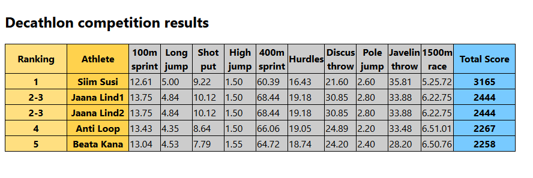

# decathlon

#### Short project description
- The program takes a csv-like input file of athlete performance results ([example input.txt](Decathlon_example_input.txt)) in a decathlon competition and produces an XML file containing each athlete's rank, score and performance data ([example output.xml](Decathlon_example_output.xml)). 
- An XSLT file is also provided ([link](decathlon.xsl)) for formatting the output xml.
- The user is prompted to enter the input and output file paths at the start of the program if they are not passed as command line arguments to the main class ([CmdLineUI](src/main/java/Decathlon/UI/CmdLineUI.java)).

#### Example output image

